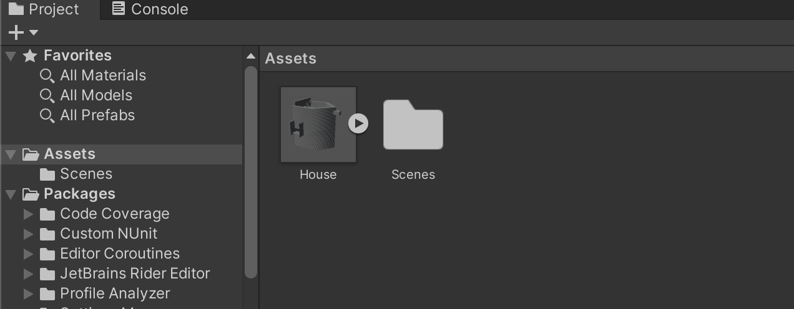
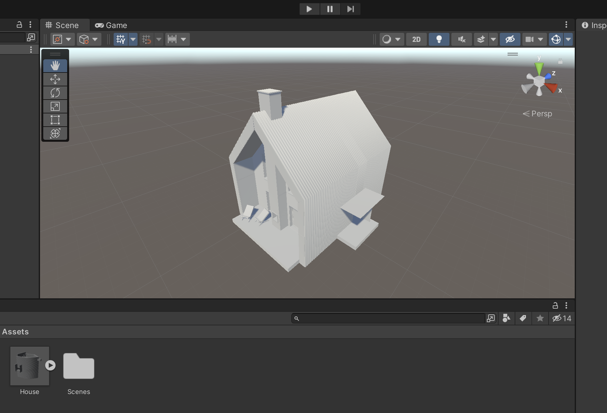

# Importing BIM file to Unity

## How-to
1. Install the Python dependencies
    ```
    pip install -r requirements.txt
    ```

2. Convert the BIM file to Obj file
    ```
    python main.py <input file> <output filepath>
    ```
    For example:
    ```
    python main.py House.bim House.obj
    ```

3. Open a project in Unity Editor and import the Obj file (Assets > Import New Assets)
4. The object should appear in the Assets pane.
    
5. Drag and drop the object to the Scene view. You may need to rotate the object.
    
6. The object is now imported to Unity!


## Implementation details

This script uses [dotbimpy](https://github.com/paireks/dotbimpy) to parse the `.bim` file and create a mesh. Then, it uses [Trimesh](https://github.com/mikedh/trimesh) to export the mesh into obj file.

The method of conversion is largely taken from this source: https://github.com/paireks/dotbimpy/blob/master/dotbimpy/other/DotbimToTrimeshScene.ipynb

Given that this is an executable Python script, it should be possible to be embedded in the simulator Unity application as a single software package.
